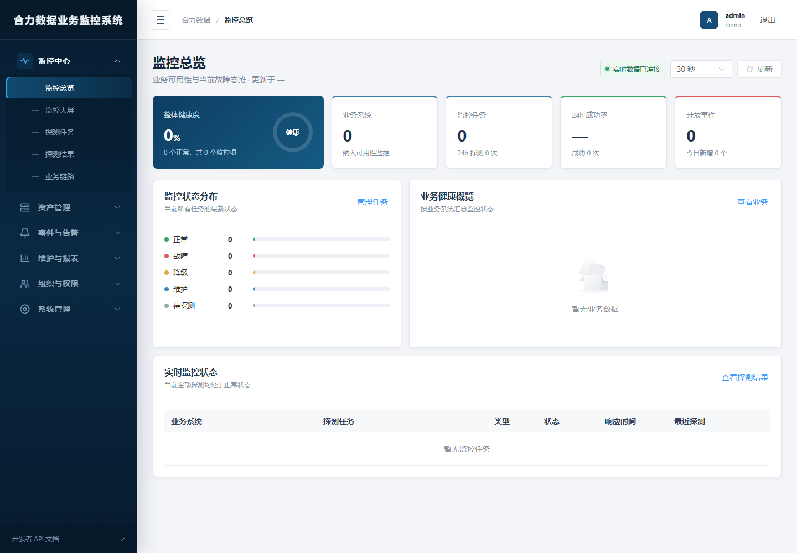

# 合力数据业务监控系统

企业级业务可用性监控平台，支持 HTTP、API、TCP、PING、DNS、SSL 等探测任务，以及故障事件、告警规则、邮件、Webhook、企业微信、钉钉和 Server 酱通知。系统提供监控总览、科技感监控大屏、探测结果、SLA 报表、状态页、用户管理和审计日志。



## 主要功能

- HTTP、API、TCP、PING、DNS、SSL，以及 Microsoft SQL Server、PostgreSQL、MySQL/MariaDB、MongoDB 探测。
- API 探测支持请求方法、请求头、认证参数、请求体、状态码和响应断言。
- 数据库探测支持连接参数、查询语句、查询结果断言和查询耗时记录。
- 实时监控总览与科技感监控大屏，展示业务、探测任务、故障事件和可用率数据。
- 故障首次通知、持续故障重复通知和恢复通知；告警规则可关联指定探测任务与通知渠道。
- 邮件 SMTP、Webhook、企业微信、钉钉和 Server 酱通知渠道，以及完整发送记录。
- 用户、部门、角色和权限管理；系统设置、登录记录、审计日志及系统健康检查。
- 维护窗口、SLA 报表和公开状态页；每个探测任务最多保留最近 10,000 条结果。

## 技术架构

- 后端：Python 3.12、Django 5、Django REST Framework、Channels
- 异步任务：Celery Worker、Celery Beat、Redis
- 前端：Vue 3、TypeScript、Vite、Element Plus、ECharts
- 数据库：PostgreSQL 16
- 网关：Nginx
- 部署：Docker Compose

## 目录说明

```text
backend/               Django API、探测、告警和通知服务
frontend/              Vue 管理端和监控大屏
deploy/nginx/          Nginx 配置
scripts/app.sh         应用启停、更新、状态和健康检查脚本
scripts/smoke_test.py  HTTP 冒烟测试
docker-compose.yml     容器编排配置
.env.example           环境变量模板
```

## 环境要求

- Linux 服务器（推荐 4 核 CPU、8 GB 内存及以上）
- Docker Engine 24+
- Docker Compose v2
- 可用端口默认是 `80`，可通过 `NGINX_PORT` 修改

## 首次部署

进入项目目录并初始化配置：

```bash
cd /opt/heli_monitor
cp .env.example .env
chmod 600 .env
chmod +x scripts/app.sh
```

编辑 `.env`，至少替换以下配置：

- `DJANGO_SECRET_KEY`：足够长的随机字符串。
- `POSTGRES_PASSWORD`：PostgreSQL 强密码，同时更新 `DATABASE_URL` 中的密码。
- `SECRET_ENCRYPTION_KEY`：用于加密通知渠道密码等敏感配置的 Base64 密钥。
- `ALLOWED_HOSTS`：允许访问的域名或服务器 IP，不包含协议和端口。
- `CSRF_TRUSTED_ORIGINS`：包含协议的可信访问地址；使用非标准端口时必须包含端口。
- `ALLOWED_PROBE_CIDRS`：允许探测的目标网段。

生成 Django 密钥和 Secret 加密密钥的示例：

```bash
python3 -c "import secrets; print(secrets.token_urlsafe(64))"
python3 -c "from cryptography.fernet import Fernet; print(Fernet.generate_key().decode())"
```

第二条命令需要本机已安装 `cryptography`；也可以在可信环境中生成后写入 `.env`。

启动应用：

```bash
./scripts/app.sh start
```

脚本会校验配置、构建镜像、启动服务，并等待存活和就绪检查通过。数据库迁移由后端启动入口自动执行。

创建管理员：

```bash
docker compose exec backend python manage.py createsuperuser
```

浏览器访问：

- 管理平台：`http://服务器地址/`
- API 文档：`http://服务器地址/api/v1/docs/`
- 存活检查：`http://服务器地址/health/live`
- 就绪检查：`http://服务器地址/health/ready`

## 离线部署包

`offline/` 提供 EL9 x86_64 环境的完整离线安装方案，包含应用镜像、Docker/Compose RPM、应用代码、完整性校验和交互式安装向导。安装时会引导输入业务端口、系统管理员用户名、至少 8 位的密码、管理员邮箱和部署目录，并在终端显示 Django 数据库迁移过程。

```bash
tar -xzf heli-monitor-offline-el9-x86_64.tar.gz
cd offline
chmod +x install.sh manage.sh
./install.sh
```

如果目标机器已经安装可用的 Docker Engine 与 Docker Compose，安装向导会跳过 Docker 安装；否则使用包内 RPM 离线安装。构建交付包的方法见 [offline/README.md](offline/README.md)。

## 基本使用流程

1. 使用管理员账号登录。系统用户密码至少为 8 位，首次登录后建议立即修改初始密码。
2. 在“资产管理 → 业务系统”中新建被监控业务，也可以按需维护业务分组和标签。
3. 在“监控中心 → 探测任务”中新建任务。选择探测类型后，按页面提示填写该类型专用参数，再执行“立即探测”确认可用。
4. 在“事件与告警 → 通知渠道”中配置渠道并执行发送测试；敏感参数会加密保存。
5. 在“事件与告警 → 告警规则”中选择探测任务和通知渠道，设置触发条件与持续提醒间隔。
6. 通过“监控总览”“监控大屏”“探测结果”和“故障事件”查看实时状态，通过“发送记录”核对通知结果。
7. 在“组织与权限”中维护用户、部门、角色及授权，在“系统管理 → 系统设置”中配置系统名称、首页标题和监控大屏标题。

## 启动与关闭

统一使用应用管理脚本：

```bash
./scripts/app.sh start             # 构建并启动
./scripts/app.sh stop              # 停止，保留数据库和 Redis 数据
./scripts/app.sh restart           # 重新构建并重启
./scripts/app.sh update            # 拉取基础镜像并更新部署
./scripts/app.sh status            # 查看容器状态
./scripts/app.sh health            # 检查应用健康
./scripts/app.sh logs              # 查看全部实时日志
./scripts/app.sh logs backend      # 只查看后端日志
./scripts/app.sh config            # 校验 Compose 配置
```

`stop` 不会删除持久化数据。不要执行 `docker compose down -v`，除非明确需要永久删除数据库和 Redis 数据。

## 服务说明

| 服务 | 用途 |
| --- | --- |
| `nginx` | 统一 Web 入口及 API/WebSocket 反向代理 |
| `frontend` | Vue 管理平台与监控大屏 |
| `backend` | Django API、鉴权、业务状态和 WebSocket |
| `worker` | 执行探测、通知发送、数据清理等异步任务 |
| `beat` | 定时扫描探测任务、持续告警和清理任务 |
| `postgres` | 业务数据持久化 |
| `redis` | Celery 队列、结果和实时状态缓存 |

探测结果按系统策略最多保留最近 10,000 条记录。业务首次真实探测失败会立即建立故障事件并通知；故障持续时按告警规则间隔重复通知；恢复后通知一次。

## 告警配置要点

1. 在“探测任务”中创建并启用任务，确认立即探测能够产生结果。
2. 在“通知渠道”中配置渠道，并通过渠道测试验证实际可达。
3. 在“告警规则”中同时选择探测任务和通知渠道，启用规则并设置持续提醒间隔。
4. 在“故障事件”和“发送记录”中核对首次故障、持续故障和恢复通知。

生产环境使用 SMTP 时，465 端口通常启用 SMTP over SSL，587 端口通常启用 STARTTLS；密码或授权码只保存在 Secret 加密字段中。

## 测试与质量检查

```bash
make lint                 # 后端 Ruff 与前端 ESLint
make test                 # 后端和前端测试
make build                # 构建全部镜像
make smoke-test           # 通过 Nginx 执行 HTTP 冒烟测试
```

也可以分别执行：

```bash
docker compose run --rm backend pytest -q
docker compose run --rm backend ruff check .
docker compose run --rm frontend npm run test
docker compose run --rm frontend npm run lint
docker compose run --rm frontend npm run build
docker compose run --rm backend python manage.py check_application
```

`check_application` 使用只读请求检查登录、资产、监控、事件、告警、报表、权限和系统设置等核心 API 是否正常响应。

## 数据备份与恢复

备份 PostgreSQL：

```bash
docker compose exec -T postgres pg_dump -U business_monitor business_monitor > heli_monitor_backup.sql
```

恢复前应先停止业务写入，并确认备份文件、目标数据库及维护窗口。恢复操作会修改生产数据，请在经过审批和验证后执行。

## 常见排障

查看状态与健康：

```bash
./scripts/app.sh status
./scripts/app.sh health
```

检查定时任务和通知任务是否已注册：

```bash
docker compose exec -T worker celery -A config inspect registered
```

查看关键日志：

```bash
./scripts/app.sh logs backend
./scripts/app.sh logs worker
./scripts/app.sh logs beat
./scripts/app.sh logs nginx
```

如果 Web 页面正常但探测或通知不执行，优先检查 `worker`、`beat` 和 Redis 状态；如果接口返回 502，检查 `backend` 健康状态和 Nginx 日志。

## 安全说明

- `.env`、数据库密码、SMTP 授权码、SendKey、Webhook Secret 和令牌不得提交到 Git。
- 生产环境应配置 HTTPS，并限制管理平台的网络访问范围。
- `ALLOWED_HOSTS`、`CSRF_TRUSTED_ORIGINS` 和探测目标网段必须按实际环境收敛。
- 禁止在日志、API 响应、测试快照和截图中暴露密钥。
- 数据库和 Redis 不对公网映射端口；外部访问统一经过 Nginx。
